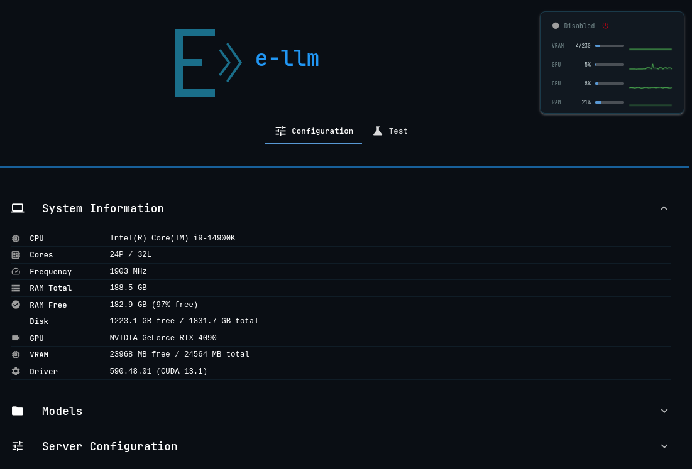
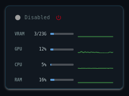
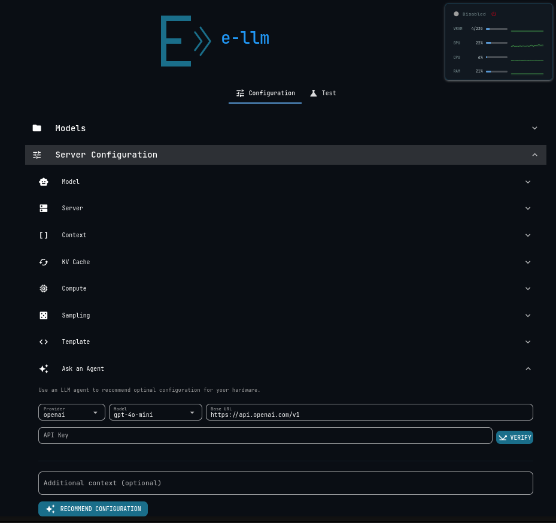

<p align="center">
  
</p>

<p align="center">
  <strong>Self-contained LLM inference server</strong> — llama.cpp + NiceGUI + nginx in a single Docker container<br>
  Configure, download, and run GGUF models (including hybrid GPU/CPU and MoE) through a clean web interface
</p>

<p align="center">
  OpenAI-compatible API &middot; Live hardware monitoring &middot; AI-powered configuration
</p>

---

## Quick Start

```bash
docker compose up -d
# Open http://localhost:45100
```

GPU required (NVIDIA + CUDA). First run will build the image (~2 min).

## Features

### Web Dashboard

A single-page interface with two tabs — **Configuration** and **Test** — that gives you full control over the inference server without touching a terminal.

<p align="center">
  
</p>

**Configuration tab** — everything you need to set up and tune the server:

- **System Information** — hardware profile at a glance: CPU model, cores, frequency, RAM (total/free), GPU name, VRAM (total/free), driver version, CUDA version, disk space.
- **Models** — search HuggingFace Hub for GGUF models, view available quantizations with file sizes, download with a real-time progress bar (percentage + GB), manage downloaded models (list, select, delete).
- **Server Configuration** — 7 collapsible sections covering every llama.cpp parameter (see [Configuration](#configuration) below).
- **Ask an Agent** — AI-powered configuration recommender (see [Annex: AI Recommender](#annex-ai-recommender)).
- **Save & Apply** — persists changes to YAML and restarts the server in one click. **Reset to Defaults** restores factory settings.

**Test tab** — a built-in chat interface to validate your setup:

- Customizable system prompt.
- Streaming responses via SSE with live token rendering.
- Markdown rendering for assistant messages.
- Model status indicator (loaded / not loaded).
- Server guard banner when the server is offline.
- Clear conversation history.

### Live Monitor

<p align="center">
  
</p>

The header includes a real-time monitoring panel that stays visible on every page:

| Element | Description |
|---------|-------------|
| **Health indicator** | Color-coded dot — green (ready), orange/pulsing (starting/loading), red (stopped/error), gray (disabled) |
| **Power button** | Toggle the llama-server on/off. Checks available VRAM before starting (>50% free required) |
| **VRAM** | Live consumption (used/total GB) with historical sparkline |
| **GPU** | GPU utilization % with sparkline |
| **CPU** | CPU usage % with sparkline |
| **RAM** | RAM usage % with sparkline |

Sparklines retain 30 data points (~1 minute of history) and are color-coded: **green** (<60%), **orange** (60–85%), **red** (>85%). Metrics poll every 2 seconds, health every 3 seconds.

### Server Control

- **Enable** — validates GPU resources are available, then starts llama-server with the current YAML config.
- **Disable** — gracefully stops the server (SIGTERM → SIGKILL fallback) and marks it as disabled.
- **Resource gating** — the power button checks VRAM availability before allowing a start. If more than 50% of VRAM is in use by other processes, the server refuses to start and shows the reason.

### OpenAI-Compatible API

The same port that serves the GUI also exposes a standard OpenAI API, proxied through nginx to the internal llama-server:

```bash
# Chat completion
curl http://localhost:45100/v1/chat/completions \
  -H "Content-Type: application/json" \
  -d '{"model":"default","messages":[{"role":"user","content":"Hello"}]}'

# Chat completion (streaming)
curl http://localhost:45100/v1/chat/completions \
  -H "Content-Type: application/json" \
  -d '{"model":"default","messages":[{"role":"user","content":"Hello"}],"stream":true}'

# List models
curl http://localhost:45100/v1/models

# Health
curl http://localhost:45100/health
```

Any client that speaks the OpenAI protocol (LangChain, DSPy, OpenAI SDK, `httpx`, `curl`) works out of the box — just point the base URL to your e-llm instance.

### Model Management

Search and download GGUF models directly from HuggingFace Hub without leaving the browser:

- **Search** — real-time search with debounce (0.6s), showing repo ID, download count, likes, and available quantizations.
- **Quantization details** — expandable list per repo showing each GGUF file with its quant type and size in GB.
- **Download** — progress bar with percentage and GB transferred. Files land in `data/models/`.
- **Local models** — list downloaded models, select one for the server, or delete unused ones.
- **Auto-detect** — if no model is configured, the server auto-detects the first GGUF file in the models directory.

Supported quantization formats:

| Category | Formats |
|----------|---------|
| **Standard** | Q2_K, Q3_K_S/M/L, Q4_0, Q4_1, Q4_K_S/M/L, Q5_0, Q5_1, Q5_K_S/M/L, Q6_K, Q8_0 |
| **IQ (importance)** | IQ1_S/M, IQ2_XS/S/M, IQ3_XS/S/M, IQ4_XS/NL |
| **Float** | F16, F32, BF16, FP8 |
| **Specialized** | MXFP4, MXFP4_MOE |
| **Unified** | UD-Q4_K_M, UD variants |

### Hybrid GPU/CPU Inference

Full control over how the model is distributed across hardware:

| Mode | How |
|------|-----|
| **Full GPU** | `n_gpu_layers = -1` — all layers on GPU |
| **Partial GPU** | `n_gpu_layers = N` — first N layers on GPU, rest on CPU |
| **GPU + CPU offload** | Combine partial layers with `no_kv_offload = true` to keep KV cache on CPU |
| **CPU-only** | `n_gpu_layers = 0` with `mlock = true` |

KV cache can be independently quantized (`q8_0`, `q4_0`, `q4_1`, `iq4_nl`, `q5_0`, `q5_1`, `f16`, `f32`) for both K and V dimensions to reduce VRAM footprint without losing model quality.

## Architecture

Single container, three internal processes:

```
:80 (nginx)
├── /           → NiceGUI     :8080   (dashboard + WebSocket)
├── /v1/*       → llama-server :45151  (OpenAI API, SSE streaming)
└── /health     → NiceGUI     :8080   (health endpoint)
```

NiceGUI manages the llama-server subprocess lifecycle (start/stop/restart) via `ServerManager`. The `ServerController` adds resource gating and state machine logic on top. `SystemMonitor` polls hardware metrics. `SystemEvaluator` builds the hardware profile used by the AI recommender.

```
src/e_llm/
├── main.py                 # NiceGUI entrypoint, lifecycle, DI
├── core/
│   ├── settings.py         # pydantic-settings (YAML + env)
│   ├── state.py            # DI container
│   ├── health.py           # Health state resolution
│   └── logger.py           # Structured logging (structlog)
├── models/
│   ├── server.py           # ServerConfig + 7 spec types (YAML bidirectional)
│   ├── system.py           # SystemInfo + CpuInfo/RamInfo/GpuInfo/DiskInfo
│   └── agent.py            # TunerInput/TunerOutput, PingResult
├── adapters/
│   ├── llamacpp.py         # httpx async client for llama-server
│   └── huggingface.py      # HuggingFace model download with progress
├── operational/
│   ├── server.py           # ServerManager (subprocess lifecycle)
│   ├── controller.py       # ServerController (enable/disable + VRAM gating)
│   ├── monitor.py          # SystemMonitor (CPU/RAM/GPU/VRAM polling)
│   ├── system.py           # SystemEvaluator (hardware detection)
│   ├── models.py           # HF Hub search + quant extraction
│   └── agents.py           # Pydantic AI agents (Tuner + Pinger)
└── pages/
    ├── config.py           # Configuration tab (7 sections + agent + models)
    └── test.py             # Test chat tab
```

## Configuration

Edit `data/config/config.yaml` or use the GUI (Configuration → Server Configuration → Save & Apply).

### Server

| Parameter | Default | Description |
|-----------|---------|-------------|
| `host` | `0.0.0.0` | Bind address |
| `port` | `45150` | Listen port |
| `alias` | `default` | Model alias returned by the API |

### Model

| Parameter | Default | Description |
|-----------|---------|-------------|
| `path` | _(empty)_ | GGUF file path (relative to `data/models/` or absolute). Empty = auto-detect |
| `n_gpu_layers` | `-1` | Layers offloaded to GPU. `-1` = all, `0` = CPU only, `N` = first N layers |

### Context

| Parameter | Default | Range | Description |
|-----------|---------|-------|-------------|
| `ctx_size` | `8192` | 512–131072 | Maximum context window in tokens |
| `parallel` | `1` | 1–64 | Number of parallel sequences |
| `batch_size` | `2048` | 32–16384 | Prompt processing batch size |
| `ubatch_size` | `512` | 32–8192 | Micro batch size |

### KV Cache

| Parameter | Default | Description |
|-----------|---------|-------------|
| `type_k` | `f16` | Key cache quantization (f16, f32, q8_0, q4_0, q4_1, iq4_nl, q5_0, q5_1) |
| `type_v` | `f16` | Value cache quantization |
| `no_kv_offload` | `false` | Keep KV cache on CPU instead of GPU |
| `defrag_thold` | `0.1` | Cache defragmentation threshold (0–1) |

### Compute

| Parameter | Default | Description |
|-----------|---------|-------------|
| `threads` | `4` | Prompt processing threads |
| `threads_batch` | `4` | Batch processing threads |
| `flash_attn` | `true` | Enable Flash Attention v2 |
| `fit` | `true` | Fit model to available VRAM |
| `mlock` | `true` | Lock model in RAM (prevent swap) |
| `no_mmap` | `false` | Disable memory-mapped I/O |

### Sampling

| Parameter | Default | Range | Description |
|-----------|---------|-------|-------------|
| `temp` | `0.7` | 0–2 | Sampling temperature |
| `top_p` | `0.95` | 0–1 | Nucleus sampling probability |
| `top_k` | `40` | 0–200 | Top-K sampling |
| `min_p` | `0.05` | 0–1 | Minimum probability threshold |
| `repeat_penalty` | `1.0` | 0–3 | Repetition penalty |

### Template

| Parameter | Default | Description |
|-----------|---------|-------------|
| `jinja` | `true` | Enable Jinja2 chat templates |
| `no_context_shift` | `false` | Disable automatic context shifting |
| `chat_template` | _(empty)_ | Custom chat template override |

### Example — High-end GPU (RTX 4090, 24 GB)

```yaml
server:
  host: 0.0.0.0
  port: 45150
  alias: qwen3-coder
model:
  path: Qwen3-Coder-480B-A35B-UD-Q4_K_XL.gguf
  n_gpu_layers: -1
context:
  ctx_size: 65536
  parallel: 1
  batch_size: 2048
  ubatch_size: 512
cache:
  type_k: q8_0
  type_v: q8_0
  no_kv_offload: true
  defrag_thold: 0.1
compute:
  threads: 20
  threads_batch: 26
  flash_attn: true
  fit: true
  mlock: true
  no_mmap: false
sampling:
  temp: 1.0
  top_p: 0.95
  top_k: 40
  min_p: 0.01
  repeat_penalty: 1.0
template:
  jinja: true
  no_context_shift: false
  chat_template: ''
```

## Docker

```bash
make docker-up       # Build + start on :45100
make docker-down     # Stop
make log             # Tail logs
```

Volumes:

| Mount | Purpose |
|-------|---------|
| `./data/config/` | YAML configuration (auto-seeded on first run) |
| `./data/models/` | Downloaded GGUF model files |
| `./data/cache/` | llama.cpp KV cache |

Production deployment with a pre-built image:

```bash
docker compose -f compose.prod.yml up -d
```

The production compose uses `ghcr.io/damvolkov/e-llm:latest`, read-only config mounts, named volumes for model persistence, and an external network (`e-core`).

## Development

```bash
make install     # uv sync + pre-commit hooks
make dev         # NiceGUI with hot-reload on :8080
make check       # lint + type + test (all three)
```

| Command | Description |
|---------|-------------|
| `make install` | Install dependencies + pre-commit hooks |
| `make sync` | Sync dependencies from lockfile |
| `make lint` | Ruff check + format |
| `make type` | ty type checker |
| `make test` | Unit tests (parallel, >90% coverage) |
| `make test-integration` | Integration tests (requires running server) |
| `make check` | lint + type + test |
| `make dev` | Run NiceGUI locally with hot-reload |
| `make docker-build` | Build Docker image |
| `make docker-up` | Build + start container |
| `make docker-down` | Stop container |
| `make log` | Tail Docker logs |
| `make clean` | Remove caches and build artifacts |

### Testing

- **Unit tests** — fully mocked, parallel (`pytest-xdist`), >90% coverage enforced.
- **Integration tests** — marked `@pytest.mark.slow`, require a running server.
- **Quality** — Ruff (8 rule sets), ty type checker, gitleaks secret scanning, all enforced via pre-commit.

```bash
make test                    # unit tests
make test-integration        # integration tests (server required)
```

## Annex: AI Recommender

<p align="center">
  
</p>

The **Ask an Agent** section in the Configuration tab connects to an external LLM to analyze your hardware and recommend the optimal server configuration — including which GGUF model to download.

### How It Works

1. **Select a provider** — OpenAI, Anthropic, or Google.
2. **Choose a model** — each provider has a pre-populated list (gpt-4o-mini, claude-sonnet, gemini-flash, etc.) or type a custom model ID.
3. **Enter your API key** and click **Verify** — the system pings the provider to validate the key and model availability, showing latency in milliseconds.
4. **Add context** (optional) — describe your use case: _"I want to run Qwen3-Coder MoE with maximum context"_, _"Optimize for throughput, not latency"_, _"CPU-only inference"_, etc.
5. **Click Recommend Configuration** — the agent reads your full hardware profile (CPU, cores, frequency, RAM, GPU, VRAM, disk) and generates a tailored configuration.

### What the Agent Knows

The recommender is a **Pydantic AI** agent with deep knowledge of:

- GGUF quantization formats (Q2_K through Q8_0, F16, IQ, UD variants).
- Hybrid GPU/CPU inference with layer splitting strategies.
- KV cache quantization and offloading trade-offs.
- Threading optimization (physical vs logical cores).
- Context window sizing relative to available VRAM.
- MoE (Mixture of Experts) model characteristics and resource requirements.

### Agent Tools

The agent has access to a real-time **HuggingFace Hub search tool** (`search_gguf_models`) that it uses to find the best GGUF model for your hardware. It can search by model name, filter by quantization type, and evaluate file sizes against your available VRAM.

### Output

The agent returns three things:

| Output | Description |
|--------|-------------|
| **Reasoning** | Detailed markdown explanation of why each parameter was chosen — VRAM budget, layer distribution, threading strategy, cache quantization rationale |
| **Model suggestion** | A specific GGUF repo and quantization from HuggingFace that fits your hardware |
| **Server configuration** | A complete `ServerConfig` with all 7 sections tuned to your system |

A dialog shows the full reasoning and proposed configuration. Click **Accept & Save** to apply it immediately (writes `config.yaml` + restarts the server) or **Discard** to go back.

### Supported Providers

| Provider | Default Model | Base URL |
|----------|---------------|----------|
| **OpenAI** | gpt-4o-mini | `https://api.openai.com/v1` |
| **Anthropic** | claude-sonnet-4-20250514 | `https://api.anthropic.com` |
| **Google** | gemini-2.0-flash | `https://generativelanguage.googleapis.com/v1beta/openai` |

Any OpenAI-compatible provider can be used by editing the base URL — this includes local inference servers, Ollama, vLLM, or any other endpoint that implements the OpenAI chat completions protocol.

## License

MIT
